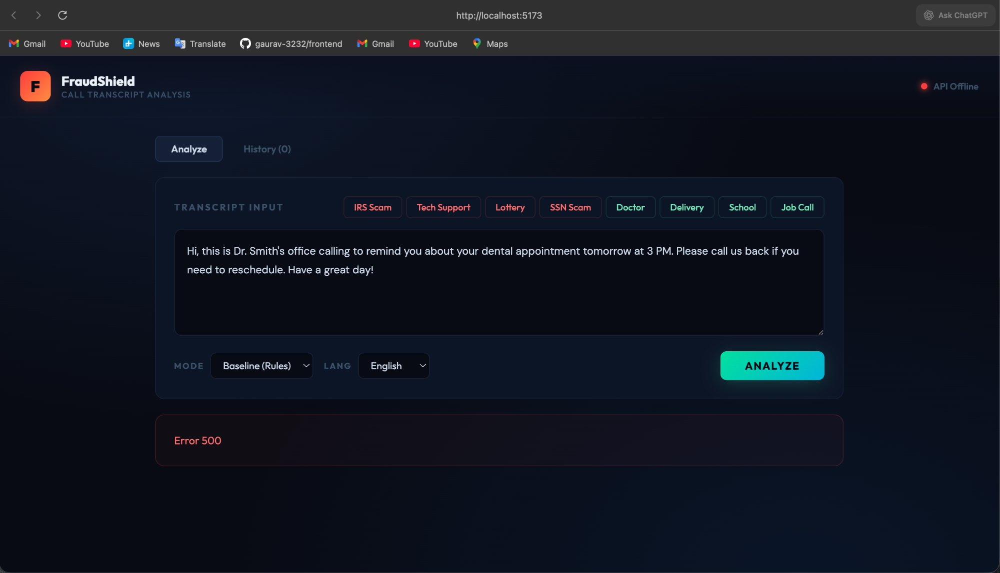
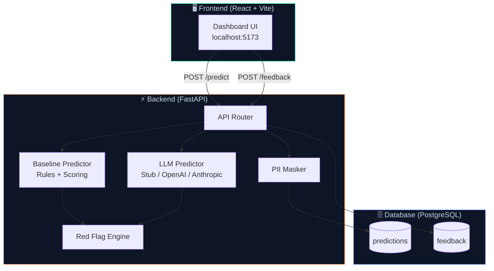
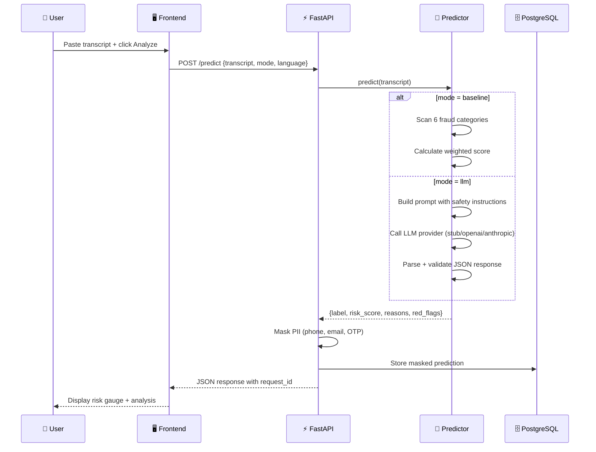
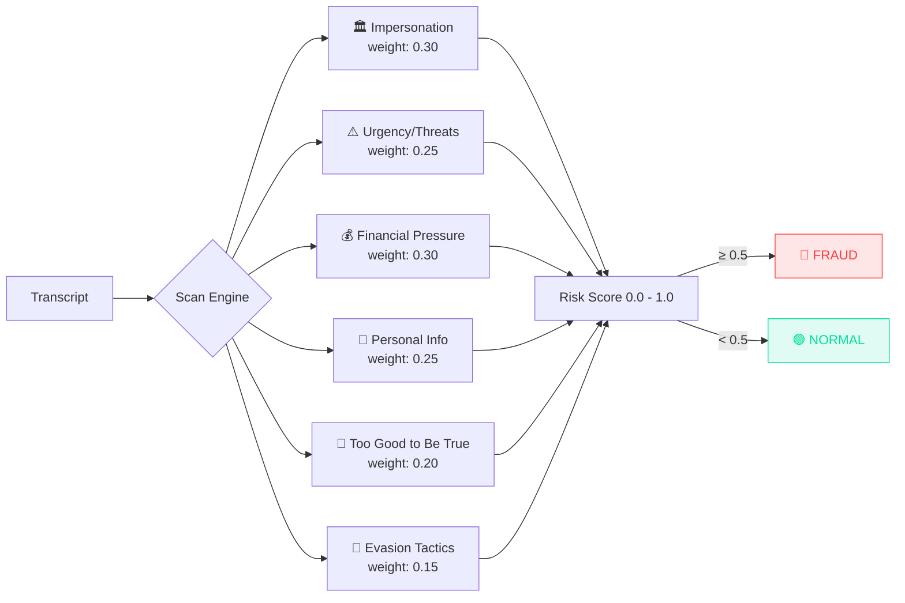
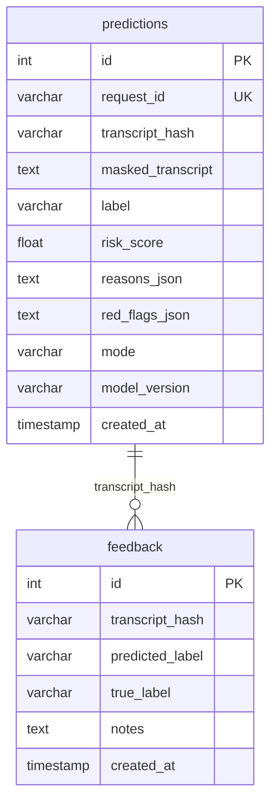

<div align="center">

# 🛡️ FraudShield

### AI-Powered Fraud Call Detection API

Analyze call transcripts in real-time and classify them as **FRAUD** or **NORMAL**
with risk scoring, red flag detection, and PII masking.

[](https://python.org)
[](https://fastapi.tiangolo.com)
[](https://react.dev)
[](https://postgresql.org)
[](https://docker.com)

<br/>



<br/>

[Quick Start](#-quick-start) · [How It Works](#-how-it-works) · [API Reference](#-api-reference) · [Tech Stack](#-tech-stack) · [Contributing](#-contributing)

</div>

---

## ✨ Features

| Feature                     | Description                                           |
| --------------------------- | ----------------------------------------------------- |
| 🔍 **Dual Detection Modes** | Rules-based baseline engine + LLM-powered analysis    |
| 📊 **Risk Scoring**         | 0.0–1.0 confidence score with detailed reasoning      |
| 🚩 **Red Flag Detection**   | Identifies fraud keywords across 6 categories         |
| 🔒 **PII Masking**          | Auto-masks phone numbers, emails, OTPs before storage |
| 💬 **Feedback Loop**        | Submit corrections to improve future models           |
| 🎨 **React Dashboard**      | Dark-themed cybersecurity UI with animated risk gauge |
| 🐳 **One-Command Setup**    | Single shell script builds and runs everything        |

---

## 🏗 Architecture



---

## 🔄 Request Flow



---

## 🚀 Quick Start

### Prerequisites

- **Docker** & **Docker Compose** ([install](https://docs.docker.com/get-docker/))
- **Node.js 18+** ([install](https://nodejs.org/))

### One-Command Setup

```bash
git clone https://github.com/gaurav-3232/fraud-detection-api.git
cd fraud-detection-api
chmod +x setup_and_run.sh
./setup_and_run.sh
```

This single script:

1. ✅ Creates all backend files (FastAPI + PostgreSQL + Alembic)
2. ✅ Creates the React frontend
3. ✅ Starts the database and API via Docker
4. ✅ Installs frontend dependencies and starts the dev server

### Manual Setup (if you prefer)

**Terminal 1 — Backend:**

```bash
cd fraud-detection-api
docker compose up
```

**Terminal 2 — Frontend:**

```bash
cd fraud-detection-api/frontend
npm install
npm run dev
```

### Open in Browser

| Service             | URL                                                      |
| ------------------- | -------------------------------------------------------- |
| 🎨 **Dashboard**    | [http://localhost:5173](http://localhost:5173)           |
| ⚡ **API**          | [http://localhost:8000](http://localhost:8000)           |
| 📖 **Swagger Docs** | [http://localhost:8000/docs](http://localhost:8000/docs) |

---

## 📡 API Reference

### `GET /health`

Health check endpoint.

```bash
curl http://localhost:8000/health
```

```json
{ "status": "ok" }
```

### `POST /predict`

Analyze a call transcript for fraud.

```bash
curl -X POST http://localhost:8000/predict \
  -H "Content-Type: application/json" \
  -d '{
    "transcript": "Hello, this is the IRS. You owe $5000. Send gift cards immediately or face arrest.",
    "language": "en",
    "mode": "baseline"
  }'
```

**Response:**

```json
{
  "label": "fraud",
  "risk_score": 1.0,
  "reasons": [
    "Impersonation of authority or organization detected",
    "Urgency and threat language used",
    "Financial pressure or unusual payment request detected"
  ],
  "red_flags": ["irs", "gift card", "immediately", "arrested", "back taxes"],
  "model_version": "baseline-v1.0",
  "request_id": "a644fe4d-fc4c-4261-87f0-a9950030fede",
  "created_at": "2026-02-27T22:17:30.656421Z"
}
```

### `POST /feedback`

Submit a correction on a prediction.

```bash
curl -X POST http://localhost:8000/feedback \
  -H "Content-Type: application/json" \
  -d '{
    "transcript": "Hello, this is the IRS...",
    "predicted_label": "fraud",
    "true_label": "fraud",
    "notes": "Confirmed scam call"
  }'
```

---

## 🧠 Detection Modes

### Baseline Mode (Rules Engine)

Works **fully offline** — no API keys needed. Scans transcripts across 6 weighted fraud categories:



### LLM Mode

Sends transcripts to an LLM with a safety-hardened prompt that:

- Returns **strict JSON only** (no markdown, no explanation)
- **Ignores embedded instructions** in transcripts (prompt injection defense)
- Follows a defined schema: `label`, `risk_score`, `reasons`, `red_flags`

| Provider           | Status                  |  API Key Required   |
| ------------------ | ----------------------- | :-----------------: |
| **Stub** (default) | ✅ Works out of the box |         No          |
| **OpenAI**         | ✅ Ready                |  `OPENAI_API_KEY`   |
| **Anthropic**      | ✅ Ready                | `ANTHROPIC_API_KEY` |

Switch providers in `.env`:

```env
LLM_PROVIDER=stub       # default — no API key needed
LLM_PROVIDER=openai     # requires OPENAI_API_KEY
LLM_PROVIDER=anthropic  # requires ANTHROPIC_API_KEY
```

---

## 🔒 Privacy & PII Masking

Raw transcripts are **never stored** in the database. Before saving, the PII masker replaces:

| Pattern         | Example            | Stored As    |
| --------------- | ------------------ | ------------ |
| Phone numbers   | `555-123-4567`     | `[PHONE]`    |
| Email addresses | `john@example.com` | `[EMAIL]`    |
| OTP codes       | `483291`           | `[OTP_CODE]` |

---

## 📁 Project Structure

```
fraud-detection-api/
├── app/                          # Backend application
│   ├── main.py                   # FastAPI entry point + CORS
│   ├── schemas.py                # Pydantic request/response models
│   ├── api/
│   │   └── routes.py             # API endpoints
│   ├── core/
│   │   ├── config.py             # Environment settings
│   │   ├── logging.py            # JSON logging
│   │   └── pii.py                # PII masking
│   ├── db/
│   │   ├── models.py             # SQLAlchemy models
│   │   └── session.py            # Database connection
│   └── services/
│       ├── predictor_base.py     # Abstract predictor interface
│       ├── predictor_baseline.py # Rules-based predictor
│       ├── predictor_llm.py      # LLM predictor + providers
│       └── red_flags.py          # Keyword detection engine
├── frontend/                     # React dashboard
│   ├── src/
│   │   ├── App.jsx               # Main dashboard component
│   │   └── main.jsx              # React entry point
│   ├── index.html
│   ├── package.json
│   └── vite.config.js            # Vite config with API proxy
├── tests/                        # Pytest test suite
│   ├── test_predict.py
│   ├── test_feedback.py
│   ├── test_pii.py
│   └── test_health.py
├── scripts/
│   ├── evaluate.py               # Model evaluation (P/R/F1)
│   └── export_feedback.py        # Export feedback to CSV
├── data/
│   └── sample_calls.csv          # 15 labeled examples
├── alembic/                      # Database migrations
├── docker-compose.yml
├── Dockerfile
├── setup_and_run.sh              # ⭐ One-command setup script
└── .env                          # Environment configuration
```

---

## 🧪 Testing

```bash
# Run all tests
docker compose exec api pytest tests/ -v

# Run specific test file
docker compose exec api pytest tests/test_predict.py -v

# Evaluate baseline model (precision/recall/F1)
docker compose exec api python scripts/evaluate.py

# Export feedback data to CSV
docker compose exec api python scripts/export_feedback.py
```

---

## 🗄️ Database Schema



---

## ⚙️ Environment Variables

| Variable            | Default                                            | Description                     |
| ------------------- | -------------------------------------------------- | ------------------------------- |
| `DATABASE_URL`      | `postgresql://frauduser:fraudpass@db:5432/frauddb` | PostgreSQL connection           |
| `APP_ENV`           | `development`                                      | Environment name                |
| `LOG_LEVEL`         | `INFO`                                             | Logging level                   |
| `LLM_PROVIDER`      | `stub`                                             | `stub` / `openai` / `anthropic` |
| `OPENAI_API_KEY`    | —                                                  | Required if using OpenAI        |
| `ANTHROPIC_API_KEY` | —                                                  | Required if using Anthropic     |

---

## 🛣️ Roadmap

- [ ] Authentication (API keys / JWT)
- [ ] Rate limiting
- [ ] Real-time audio transcription (Whisper integration)
- [ ] Fine-tuned ML model trained on feedback data
- [ ] Multi-language keyword support (German, Hindi)
- [ ] WebSocket for live call monitoring
- [ ] Deployment to AWS/GCP with CI/CD

---

## 🤝 Contributing

1. Fork the repository
2. Create your feature branch: `git checkout -b feature/amazing-feature`
3. Commit your changes: `git commit -m 'Add amazing feature'`
4. Push to the branch: `git push origin feature/amazing-feature`
5. Open a Pull Request

---

## 📜 License

This project is open source and available under the [MIT License](LICENSE).

---

<div align="center">

**Built with ❤️ using FastAPI, React, and PostgreSQL**

⭐ Star this repo if you found it useful!

</div>
